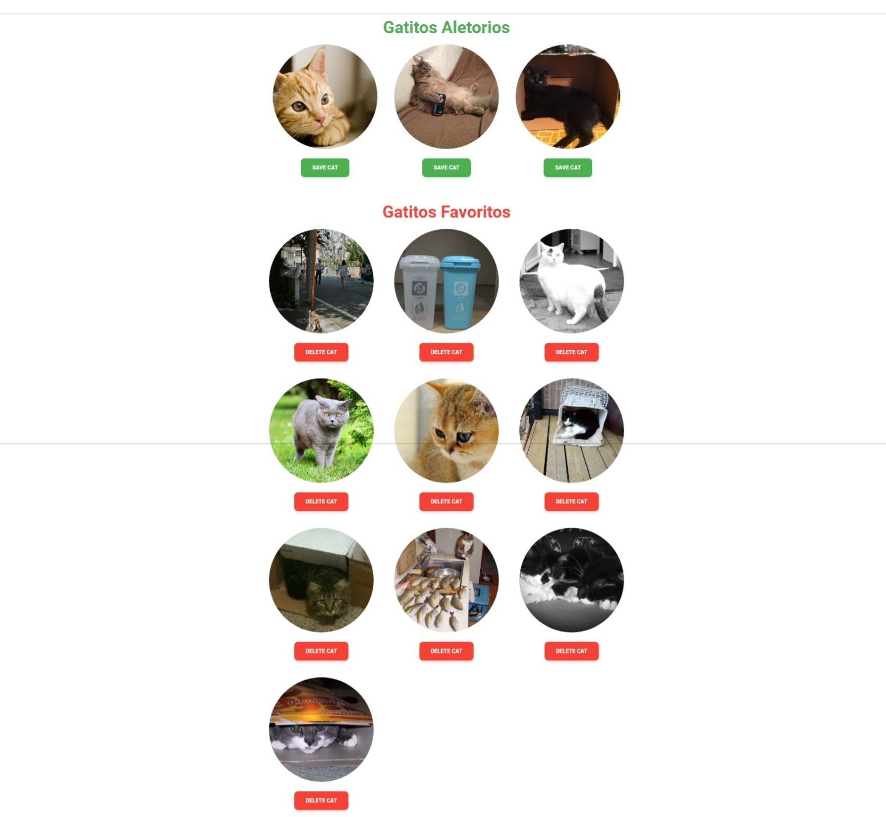

# Cat Gallery - React Project (v4.0)



Una moderna y optimizada Single Page Application (SPA) desarrollada con React que permite a los usuarios explorar una galería de imágenes de gatos, guardar sus favoritos y personalizar la interfaz de usuario en tiempo real.

Este proyecto sirve como un caso de estudio avanzado sobre arquitectura de frontend, buenas prácticas y optimización de rendimiento en el ecosistema de React.

---

## 1. Tecnologías Principales

-   **Core:** [React 19](https://react.dev/)
-   **Build Tool:** [Vite](https://vitejs.dev/)
-   **Estilos:** [Tailwind CSS](https://tailwindcss.com/) (Utility-First)
-   **Gestión de Estado:**
    -   [Redux Toolkit](https://redux-toolkit.js.org/): para el estado global y la lógica asíncrona.
    -   [React Context](https://react.dev/learn/passing-data-deeply-with-context): para el estado de la UI (tema y fuente).
-   **Notificaciones:** [React Hot Toast](https://react-hot-toast.com/)
-   **Iconos:** [React Icons](https://react-icons.github.io/react-icons/)
-   **Cliente HTTP:** [Axios](https://axios-http.com/)
-   **Gestor de Paquetes:** [pnpm](https://pnpm.io/)

---

## 2. Arquitectura del Sistema

El proyecto está construido sobre una **Arquitectura por Features (Feature-Based Architecture)**, diseñada para maximizar la escalabilidad, mantenibilidad y el encapsulamiento del código.

-   **Filosofía Principal:** En lugar de agrupar archivos por su tipo (ej. `/components`, `/hooks`), el código se organiza por funcionalidad o "feature" (ej. `/features/cats`, `/features/theme`).
-   **Separación de Responsabilidades:** Se utiliza una estrategia de estado híbrida y robusta:
    1.  **Redux Toolkit** para gestionar el estado complejo y asíncrono de la aplicación (la data de los gatos).
    2.  **React Context** para el estado de la UI, que es más simple y localizado (tema y fuente).
-   **Alias de Ruta (`@`):** Se utilizan alias (`@app`, `@features`, `@shared`) para simplificar las importaciones, mejorar la legibilidad y hacer la base de código más robusta ante refactorizaciones.
-   **Estilos Utility-First:** Se sigue estrictamente la metodología de Tailwind CSS. La reutilización y abstracción se logran a través de **componentes de React**, no mediante clases CSS personalizadas.

### Estructura de Carpetas (`src`)

```
src/
├── app/
│   └── store.js         # Configuración central del store de Redux
├── features/
│   ├── cats/            # Feature: Lógica y UI para los gatos
│   ├── font/            # Feature: Lógica y UI para la selección de fuente
│   └── theme/           # Feature: Lógica y UI para el cambio de tema
├── shared/
│   └── components/      # Componentes reutilizables (esqueletos, etc.)
├── doc/
│   └── ...              # Documentación técnica y de arquitectura
├── services/
│   └── catApi.js        # Lógica para interactuar con TheCatAPI
├── main.jsx             # Punto de entrada de la aplicación
└── App.jsx              # Componente raíz de la aplicación
```

---

## 3. Instalación y Ejecución

### Requisitos Previos
-   Node.js v18+
-   pnpm

### Pasos

1.  **Clonar el repositorio:**
    ```bash
    git clone <URL_DEL_REPOSITORIO>
    cd myprojectapi11
    ```

2.  **Instalar dependencias:**
    ```bash
    pnpm install
    ```

3.  **Ejecutar en modo de desarrollo:**
    La aplicación estará disponible en `http://localhost:5173`.
    ```bash
    pnpm run dev
    ```

4.  **Construir para producción:**
    Los archivos estáticos se generarán en la carpeta `dist/`.
    ```bash
    pnpm run build
    ```

5.  **Linting:**
    Ejecutar el linter para verificar la calidad del código.
    ```bash
    pnpm run lint
    ```

---

## 4. Detalle de Módulos y Features

### Feature: `cats`
-   **Responsabilidad:** Gestionar todo lo relacionado con los gatos: obtenerlos de la API, guardarlos como favoritos, eliminarlos y mostrar las listas.
-   **Componentes Clave:** `CatList`, `CatCard`.
-   **Estado:** Gestionado por `catsSlice.js` (Redux) y expuesto a través del hook `useCats.js`.

### Feature: `theme`
-   **Responsabilidad:** Gestionar el cambio entre el modo claro y oscuro.
-   **Componentes Clave:** `ThemeToggleButton`.
-   **Estado:** Gestionado por `ThemeContext.jsx` y persistido en `localStorage`.

### Feature: `font`
-   **Responsabilidad:** Gestionar el cambio dinámico de la tipografía de la aplicación.
-   **Componentes Clave:** `FontDropdown`.
-   **Estado:** Gestionado por `FontContext.jsx` y persistido en `localStorage`.

### Módulo `shared`
-   Contiene componentes agnósticos y reutilizables, como los esqueletos de carga (`SkeletonGrid`, `SkeletonCard`), que pueden ser utilizados por cualquier feature.

---

## 5. Decisiones de Diseño y Buenas Prácticas

-   **Componente Fachada (`useCats`):** El hook `useCats` actúa como una fachada que simplifica la interacción con el store de Redux. Los componentes de React no necesitan saber sobre `dispatch` o `useSelector`; simplemente consumen el hook.
-   **Optimización de Rendimiento:**
    -   **Lazy Loading de Componentes:** `CatList` se carga de forma diferida con `React.lazy`.
    -   **Lazy Loading de Imágenes:** Las imágenes de los gatos utilizan el atributo nativo `loading="lazy"`.
    -   **Memoización:** `CatCard` está envuelto en `React.memo` para prevenir re-renderizados innecesarios.
-   **Experiencia de Usuario (UX):**
    -   **Feedback Inmediato:** Se utilizan notificaciones "toast" para confirmar acciones.
    -   **Manejo de Errores Resiliente:** El mensaje de error incluye un botón "Reintentar".
    -   **Estados de Carga y Vacíos:** Se usan esqueletos de carga y mensajes informativos para guiar al usuario.
-   **Sistema de Iconos Unificado:** Todos los iconos provienen de `react-icons` para garantizar consistencia visual y de mantenimiento.

## 6. Roadmap y Mejoras Futuras

-   [ ] **Paginación:** Implementar paginación o scroll infinito en la lista de "Random Kittens" para cargar más imágenes.
-   [ ] **Pruebas Unitarias y de Integración:** Añadir cobertura de pruebas con una librería como Vitest.
-   [ ] **Componente de Dropdown Personalizado:** Reemplazar el `<select>` nativo de `FontDropdown` por un componente de dropdown totalmente personalizado y accesible para un control visual total.
-   [ ] **Animaciones Avanzadas:** Explorar librerías como `Framer Motion` para añadir animaciones más ricas a la interfaz.
