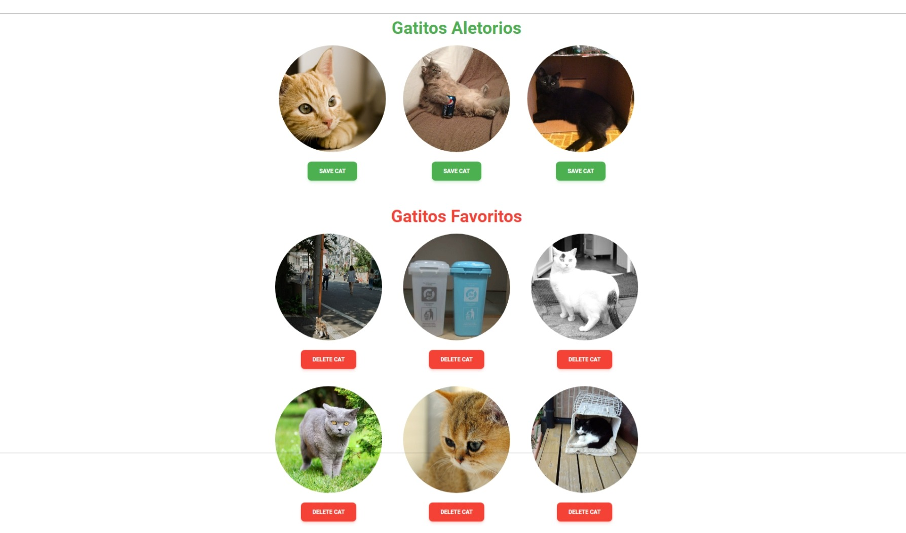

# Proyecto de Galería de Gatos con React y Redux

Este proyecto es una aplicación web que muestra una galería de imágenes de gatos obtenidas desde [TheCatAPI](https://thecatapi.com/). Permite a los usuarios ver imágenes de gatos aleatorias y guardarlas en una lista de favoritos.

Esta versión del proyecto ha sido completamente refactorizada para seguir principios de **Arquitectura Limpia** y **Clean Code**, mejorando su mantenibilidad, escalabilidad y rendimiento.



---

## Características

-   **Gatos Aleatorios:** Muestra una selección de imágenes de gatos obtenidas de forma aleatoria.
-   **Galería de Favoritos:** Permite guardar los gatos que más te gusten en una sección de favoritos.
-   **Persistencia (Simulada):** Los gatos favoritos se pueden añadir y eliminar, actualizando el estado de la aplicación de forma optimista.
-   **Diseño Responsivo:** La interfaz se adapta a diferentes tamaños de pantalla.

---

## Instalación y Configuración

Sigue estos pasos para configurar y ejecutar el proyecto en tu entorno local.

### Prerrequisitos

-   [Node.js](https://nodejs.org/) (versión 18 o superior)
-   [npm](https://www.npmjs.com/) (generalmente se instala con Node.js)
-   Una **API Key** de [TheCatAPI](https://thecatapi.com/signup).

### Pasos

1.  **Clona el repositorio:**

    ```bash
    git clone https://github.com/slinkter/myprojectapi0x.git
    cd myprojectapi0x
    ```

2.  **Instala las dependencias:**

    ```bash
    npm install
    ```

3.  **Configura las variables de entorno:**

    Crea un archivo `.env` en la raíz del proyecto y añade las siguientes variables. Reemplaza `TU_API_KEY` con la clave que obtuviste de TheCatAPI.

    ```env
    VITE_API_KEY="TU_API_KEY"
    VITE_BASE_URL="https://api.thecatapi.com/v1"
    ```

    > **Importante:** El archivo `.env` está incluido en el `.gitignore` para evitar que las claves secretas se suban al repositorio.

---

## Ejecución

Una vez completada la instalación, puedes ejecutar la aplicación en modo de desarrollo:

```bash
npm run dev
```

Esto iniciará un servidor de desarrollo local. Abre tu navegador y visita [http://localhost:5173](http://localhost:5173) para ver la aplicación en funcionamiento.

---

## Arquitectura del Proyecto

El proyecto ha sido reestructurado para separar responsabilidades, siguiendo los principios de la Arquitectura Limpia. La estructura de la carpeta `src` es la siguiente:

```
src/
├── components/     # Componentes de React reutilizables y de presentación
│   ├── CatCard.jsx
│   └── CatList.jsx
├── hooks/          # Custom Hooks de React para encapsular lógica
│   └── useCats.js
├── redux/          # Configuración y slices de Redux
│   ├── catsSlice.js
│   └── store.js
├── services/       # Módulos para interactuar con APIs externas
│   └── catApi.js
├── App.jsx         # Componente principal que ensambla la aplicación
└── main.jsx        # Punto de entrada de la aplicación
```

### Mejoras Aplicadas

1.  **Capa de Servicios (`/services`):**
    -   Se creó `catApi.js` para aislar toda la lógica de `axios` y las llamadas a la API. Esto desacopla la obtención de datos de la lógica de estado y hace que el código sea más fácil de probar y mantener.

2.  **Custom Hook (`/hooks`):**
    -   Se implementó `useCats.js`, un *custom hook* que encapsula toda la interacción con el *store* de Redux (selección de estado y despacho de acciones). Los componentes ahora pueden consumir el estado y los manejadores de eventos sin conocer los detalles de implementación de Redux.

3.  **Componentes Atómicos y Reutilizables (`/components`):**
    -   `App.jsx` se limpió de lógica y ahora actúa como un contenedor.
    -   Se creó `CatList.jsx`, un componente reutilizable para renderizar cualquier lista de gatos, eliminando el código duplicado que existía anteriormente.
    -   `CatCard.jsx` se simplificó y ahora espera una estructura de datos normalizada.

4.  **Gestión de Estado Optimizada (`/redux`):**
    -   El `catsSlice.js` fue refactorizado para usar el nuevo servicio de API.
    -   Las acciones de `guardar` y `eliminar` ahora realizan **actualizaciones optimistas**, modificando el estado local inmediatamente y mejorando la experiencia del usuario al no tener que esperar una recarga completa de la lista.

---

## Scripts Disponibles

En el archivo `package.json` puedes encontrar los siguientes scripts:

-   `npm run dev`: Inicia el servidor de desarrollo.
-   `npm run build`: Compila la aplicación para producción en la carpeta `dist/`.
-   `npm run lint`: Ejecuta ESLint para analizar el código en busca de errores y problemas de estilo.
-   `npm run preview`: Sirve localmente el *build* de producción para previsualización.
-   `npm run deploy`: Despliega la aplicación en GitHub Pages (requiere configuración previa).