# Gestión del Proyecto (PMBOK)

## 1. Grupos de Procesos Aplicados

Para la ejecución de la refactorización y corrección de la "Cat Gallery", se aplicaron procesos de los 5 grupos definidos por el PMBOK:

1.  **Inicio:** Desarrollo del Acta de Constitución (ver `01_ACTA_CONSTITUCION.md`) e identificación de Interesados.
2.  **Planificación:** Definición del alcance (Migración Tailwind v4), desglose de la estructura de trabajo (WBS) y planificación de la gestión de configuración.
3.  **Ejecución:** Implementación de código, refactorización de componentes, gestión del conocimiento (investigación de documentación Tailwind v4).
4.  **Monitoreo y Control:** Control de calidad (verificación de estilos, linter), control de cambios (Manejo de la ruptura por actualización automática).
5.  **Cierre:** Documentación de lecciones aprendidas y entrega final de artefactos.

## 2. Matriz de Interesados (Stakeholder Register)

| Nombre            | Rol                   | Influencia | Interés | Estrategia de Gestión                                                                          |
| :---------------- | :-------------------- | :--------- | :------ | :--------------------------------------------------------------------------------------------- |
| Usuario (USER)    | Sponsor / Cliente     | Alta       | Alta    | Gestionar atentamente. Mantener informado en tiempo real. Priorizar sus solicitudes de cambio. |
| AI Assistant      | Project Manager / Dev | Alta       | Alta    | Ejecución responsable. Proactividad en la solución de problemas técnicos.                      |
| Librería Tailwind | Proveedor Externo     | Media      | Bajo    | Monitorear actualizaciones y changelogs. Adaptarse a cambios (Breaking Changes).               |
| The Cat API       | Proveedor de Datos    | Baja       | Bajo    | Monitorear disponibilidad del servicio.                                                        |

## 3. Matriz de Riesgos

| ID   | Riesgo                                                                                                      | Probabilidad | Impacto | Nivel   | Estrategia de Respuesta                                                                                 |
| :--- | :---------------------------------------------------------------------------------------------------------- | :----------- | :------ | :------ | :------------------------------------------------------------------------------------------------------ |
| R-01 | **Ruptura por Actualizaciones:** Ejecutar `update --latest` rompe el build.                                 | Alta         | Alto    | Crítico | **Mitigar:** Usar `pnpm update` (sin flags) o revisar changelogs antes. Usar versiones fijas (Pinning). |
| R-02 | **Incompatibilidad de Librerías:** Librerías de UI (Material) no soportan tecnologías nuevas (Tailwind v4). | Media        | Alto    | Alto    | **Evitar:** Reducir dependencia de librerías de terceros (Vendor Lock-in). Usar estándares nativos.     |
| R-03 | **Pérdida de Estilos:** El modo oscuro deja de funcionar por cambios en la configuración.                   | Media        | Medio   | Medio   | **Aceptar/Corregir:** Implementar pruebas visuales rápidas tras cada actualización.                     |

## 4. Cronograma del Proyecto (Simulado)

### Estructura de Desglose de Trabajo (WBS)

1.  **Diagnóstico**
    1.1. Análisis de error de compilación.
    1.2. Revisión de documentación oficial Tailwind v4.
2.  **Corrección de Infraestructura**
    2.1. Instalación de adaptadores PostCSS.
    2.2. Migración de `index.css`.
3.  **Refactorización UI**
    3.1. Eliminación Material Tailwind.
    3.2. Rediseño `CatCard`.
    3.3. Rediseño `ThemeToggle`.
    3.4. Rediseño `FontDropdown`.
4.  **Optimización y Cierre**
    4.1. Reparación Modo Oscuro.
    4.2. Documentación.

### Diagrama de Gantt

```mermaid
gantt
    title Cronograma de Recuperación y Migración
    dateFormat  HH:mm
    axisFormat  %H:%M

    section Diagnóstico
    Análisis de Error        :done, des1, 11:00, 5m
    Investigación V4         :done, des2, after des1, 10m

    section Ejecución
    Migración Config         :done, imp1, after des2, 10m
    Eliminar Dependencias    :done, imp2, after imp1, 5m
    Refactor Componentes     :done, imp3, after imp2, 15m

    section QA & Fixes
    Fix Modo Oscuro          :done, qa1, after imp3, 5m
    Fix Dropdown Fuente      :done, qa2, after qa1, 5m

    section Cierre
    Documentación            :active, doc1, after qa2, 10m
```

## 5. Gestión de la Calidad

Se han establecido las siguientes métricas de calidad para el código entregado:

-   **Linting:** 0 errores de ESLint.
-   **Consistencia Visual:** Todos los componentes deben responder al cambio de tema (Claro/Oscuro) en <100ms.
-   **Limpieza:** No debe haber código comentado ni importaciones no utilizadas (Dead Code). _Estado: Validado en la última revisión._
