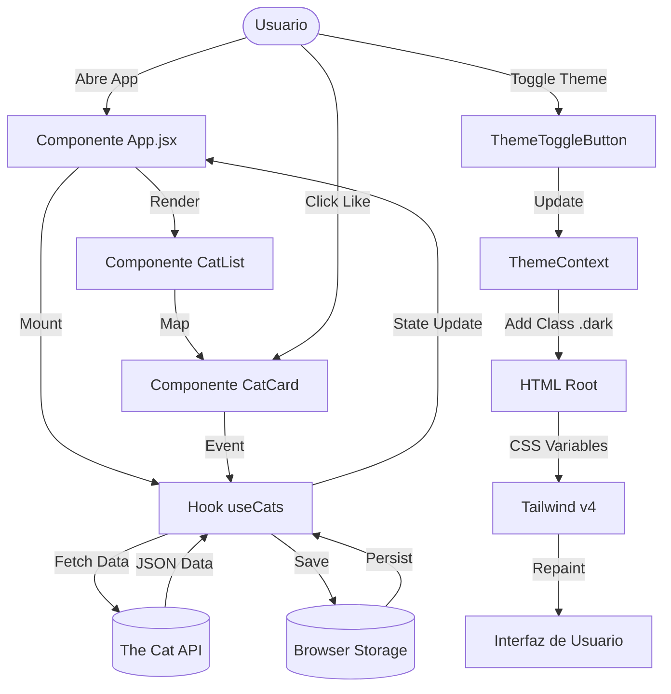

# Requisitos y Casos de Uso (Ingeniería de Software)

## 1. Requerimientos Funcionales (RF)

| ID        | Requerimiento               | Descripción                                                                                                               | Prioridad |
| :-------- | :-------------------------- | :------------------------------------------------------------------------------------------------------------------------ | :-------- |
| **RF-01** | Visualizar Gatos Aleatorios | El sistema debe cargar y mostrar una cuadrícula de imágenes de gatos obtenidas de una API externa al iniciar.             | Alta      |
| **RF-02** | Guardar Favorito            | El usuario debe poder marcar un gato como "Favorito" haciendo clic en el icono de corazón.                                | Alta      |
| **RF-03** | Eliminar Favorito           | El usuario debe poder eliminar un gato de la lista de favoritos.                                                          | Media     |
| **RF-04** | Persistencia de Datos       | Los favoritos deben persistir en el `LocalStorage` del navegador entre sesiones.                                          | Alta      |
| **RF-05** | Cambio de Tema              | El usuario debe poder alternar entre "Modo Claro" y "Modo Oscuro" mediante un botón en la cabecera.                       | Alta      |
| **RF-06** | Cambio de Tipografía        | El usuario debe poder seleccionar una fuente de una lista predefinida para cambiar la tipografía global de la aplicación. | Media     |

## 2. Requerimientos No Funcionales (RNF)

| ID         | Categoría      | Descripción                                                                                                 | Métrica           |
| :--------- | :------------- | :---------------------------------------------------------------------------------------------------------- | :---------------- |
| **RNF-01** | Rendimiento    | Las imágenes deben cargar progresivamente y la interfaz no debe bloquearse (Lazy Loading).                  | TTI < 1.5s        |
| **RNF-02** | Ui/UX          | La interfaz debe ser responsiva (adaptable a Móvil, Tablet, Desktop) y estéticamente agradable ("Premium"). | Diseño Responsive |
| **RNF-03** | Compatibilidad | La aplicación debe funcionar en las últimas 2 versiones de Chrome, Firefox, Safari y Edge.                  | Cross-browser     |
| **RNF-04** | Mantenibilidad | El código debe seguir el estándar ESLint y usar componentes funcionales de React.                           | Clean Code        |

## 3. Diagrama de Flujo de Datos (DFD)

### Flujo Principal: Carga e Interacción

## 4. Casos de Uso Detallados

### CU-01: Personalizar Apariencia (Tema y Fuente)

**Actor:** Usuario Final.
**Precondición:** La aplicación está cargada.
**Flujo Principal:**

1.  El usuario visualiza la barra de navegación superior.
2.  El usuario hace clic en el selector de fuentes y elige "Roboto Mono".
3.  **Sistema:** Actualiza la variable CSS `--font-family` globalmente.
4.  **Sistema:** La interfaz cambia de tipografía instantáneamente.
5.  El usuario hace clic en el icono de "Luna".
6.  **Sistema:** Añade la clase `.dark` al elemento raíz.
7.  **Sistema:** Tailwind aplica los estilos oscuros (fondo gris, texto blanco).
    **Postcondición:** La aplicación muestra la nueva configuración visual y la guarda en LocalStorage.

### CU-02: Gestionar Favoritos

**Actor:** Usuario Final.
**Flujo Principal:**

1.  El usuario navega por la sección "Random Kittens".
2.  El usuario pasa el cursor sobre una tarjeta de gato.
3.  **Sistema:** Muestra el overlay con el botón "Me gusta".
4.  El usuario hace clic en "Me gusta".
5.  **Sistema:** Verifica si el gato ya existe en favoritos.
6.  **Sistema:** Si no existe, lo añade al estado y al LocalStorage.
7.  **Sistema:** Muestra el gato añadido en la sección "Favourite Kittens".
    **Flujo Alternativo (Ya existe):**
8.  Si el usuario intenta guardar un gato repetido, el sistema deshabilita el botón o no realiza acción (según lógica `disabled`).

## 5. Matriz de Trazabilidad de Requisitos (RTM)

| ID Req | Caso de Uso | Componente Software                         | Estado       |
| :----- | :---------- | :------------------------------------------ | :----------- |
| RF-01  | CU-02       | `useCats.js`, `CatList.jsx`                 | Implementado |
| RF-02  | CU-02       | `CatCard.jsx`                               | Implementado |
| RF-04  | CU-02       | `useCats.js` (LocalStorage)                 | Implementado |
| RF-05  | CU-01       | `ThemeContext.jsx`, `ThemeToggleButton.jsx` | Implementado |
| RF-06  | CU-01       | `FontContext.jsx`, `FontDropdown.jsx`       | Implementado |
