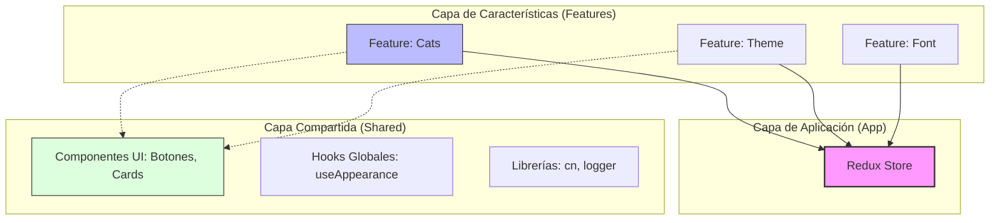

# 00 — Introducción Pedagógica: ¿Por qué esta Arquitectura?

> "No construimos aplicaciones solo para que funcionen; las construimos para que puedan crecer sin romperse".

Este proyecto, **Cat Gallery**, no es solo una galería de fotos de gatos. Es una **referencia de arquitectura limpia** diseñada para enseñar cómo resolver los problemas comunes del desarrollo con React a gran escala.

---

## 1. El Problema: El "Código Espagueti"

Imagina que estás construyendo esta misma aplicación de forma tradicional (Junior approach). Probablemente terminarías con estos problemas:

### Escenario A: El Componente "Dios"
Tienes un archivo `App.jsx` de 500 líneas que hace todo:
- Llama a `fetch()` directamente en un `useEffect`.
- Gestiona el estado de carga, errores, favoritos y el tema visual.
- Renderiza toda la UI en un solo bloque.
- **Resultado:** Si quieres cambiar la API de gatos, tienes que tocar el archivo donde está la UI. Si rompes la UI, rompes la lógica de datos.

### Escenario B: El "Prop Drilling" (Taladrado de Props)
Para pasar un dato desde la raíz hasta el botón de "Favorito" dentro de una tarjeta, tienes que pasarlo por 5 niveles de componentes intermedios que no necesitan ese dato.
- **Resultado:** Código difícil de seguir y propenso a errores al renombrar una prop.

---

## 2. La Solución: Arquitectura por Capas (FSD)

Para resolver esto, aplicamos **Feature-Sliced Design (FSD)** y el **Patrón Fachada (Facade)**.

### El Concepto: "Divide y Vencerás"

En lugar de mezclarlo todo, separamos la aplicación en piezas que no saben nada de las otras (bajo acoplamiento) pero trabajan juntas (alta cohesión).

---

## 3. De lo Simple a lo Complejo

En esta documentación, aprenderás cómo pasamos de un simple botón a un sistema orquestado:

1.  **Nivel 1 (Atómico):** Componentes visuales puros en `shared/ui`. No saben qué es un "Gato".
2.  **Nivel 2 (Dominio):** Lógica de datos en `features/cats/redux`. Cómo pedimos datos y los transformamos.
3.  **Nivel 3 (Orquestación):** El Hook de Fachada `useCats.js`. Une la UI con los datos sin que la UI sepa que existe Redux.
4.  **Nivel 4 (Efectos):** Sincronización con el mundo real (localStorage, DOM) mediante `useAppearance`.

---

## 4. Mapa Mental de la Solución

| Si el problema es... | La solución en este proyecto es... | ¿Dónde verlo? |
| :--- | :--- | :--- |
| **Código API mezclado con UI** | Patrón Service + Mapper | `features/cats/services/` |
| **Estado difícil de rastrear** | Redux Toolkit (Slices) | `features/cats/redux/` |
| **Componentes con demasiada lógica** | Custom Hooks (Fachadas) | `features/cats/hooks/` |
| **Conflictos de estilos CSS** | Tailwind CSS + Utility `cn()` | `shared/lib/classNames.js` |

---

**Próximo Paso:** [00-GUIA-CONFIGURACION.md](./00-SETUP-GUIDE.md) para ver cómo montar la infraestructura técnica.
