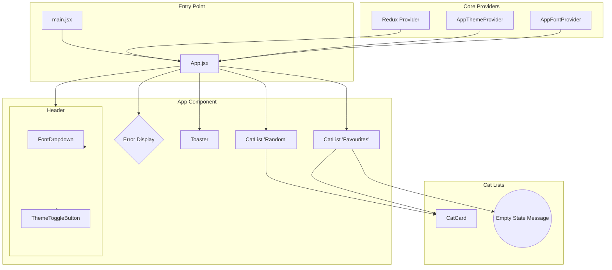
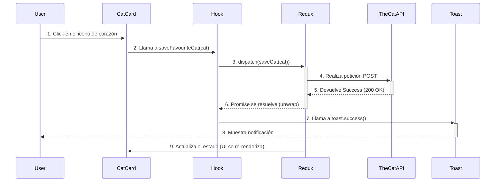

# Documento Técnico del Software: Cat Gallery

**Versión:** 1.0
**Fecha:** 26 de Diciembre, 2025

## 1. Visión General del Sistema

"Cat Gallery" es una Single Page Application (SPA) cuyo propósito es proporcionar una experiencia de usuario fluida y agradable para visualizar y gestionar una colección de imágenes de gatos obtenidas a través de una API pública. La aplicación está diseñada con un enfoque en la personalización de la interfaz (temas y fuentes) y la optimización del rendimiento.

Arquitectónicamente, el sistema sigue un modelo de **Arquitectura por Features**, utilizando un stack tecnológico moderno basado en React, Vite y Tailwind CSS.

---

## 2. Requerimientos del Sistema

### 2.1. Requerimientos Funcionales (RF)

| ID     | Requerimiento                      | Descripción                                                                                                                |
| :----- | :--------------------------------- | :------------------------------------------------------------------------------------------------------------------------- |
| **RF-1** | Visualizar Gatos Aleatorios        | El sistema debe cargar y mostrar una cuadrícula de imágenes de gatos obtenidas de una API externa.                       |
| **RF-2** | Guardar y Eliminar Favoritos       | El usuario debe poder marcar/desmarcar un gato como "Favorito".                                                            |
| **RF-3** | Persistencia de Sesión             | Las preferencias del usuario (favoritos, tema, fuente) deben persistir entre sesiones utilizando `LocalStorage`.           |
| **RF-4** | Personalización de UI              | El usuario debe poder alternar entre un tema claro/oscuro y seleccionar una tipografía de una lista predefinida.          |
| **RF-5** | Feedback de Acciones               | El sistema debe proveer notificaciones emergentes (toasts) para confirmar acciones exitosas o reportar errores.            |
| **RF-6** | Recuperación de Errores            | Ante un fallo en la carga de datos, el sistema debe ofrecer una opción para reintentar la operación.                      |

### 2.2. Requerimientos No Funcionales (RNF)

| ID      | Categoría        | Descripción                                                                                                              |
| :------ | :--------------- | :----------------------------------------------------------------------------------------------------------------------- |
| **RNF-1** | Rendimiento      | La aplicación debe tener tiempos de carga iniciales rápidos (LCP < 2.5s) y ser altamente responsiva a la interacción. |
| **RNF-2** | Mantenibilidad   | El código debe ser modular, desacoplado y fácil de entender, siguiendo la arquitectura por features y las guías de estilo. |
| **RNF-3** | Usabilidad       | La interfaz debe ser intuitiva, guiar al usuario en estados vacíos y ser consistente en su diseño y comportamiento.    |
| **RNF-4** | Escalabilidad    | La arquitectura debe permitir añadir nuevas features (ej. paginación, búsqueda) con un impacto mínimo en el código existente. |

---

## 3. Arquitectura y Diseño

### 3.1. Arquitectura Lógica

La aplicación utiliza una **Arquitectura por Features** combinada con un directorio `app` para la lógica central y `shared` para elementos comunes.

-   **Capa de Aplicación (`/app`):** Contiene la configuración singleton y el "cerebro" de la aplicación, como el `store` de Redux. Es el punto de orquestación.
-   **Capa de Features (`/features`):** Contiene la lógica de negocio vertical. Cada feature (`cats`, `theme`, `font`) es un módulo autocontenido.
-   **Capa Compartida (`/shared`):** Contiene componentes de UI (esqueletos) y utilidades que son agnósticos a la lógica de negocio y pueden ser consumidos por cualquier feature.

### 3.2. Diagrama de Componentes

Este diagrama muestra las relaciones y dependencias entre los componentes principales de la aplicación.



### 3.3. Flujo de Datos: Guardar un Favorito

Este diagrama ilustra la secuencia de eventos cuando un usuario guarda un gato como favorito.



---

## 4. Gestión de Estado

El estado se divide en dos categorías principales para optimizar la eficiencia y la separación de conceptos:

1.  **Estado Global de la Aplicación (Redux):**
    -   **Ubicación:** `src/app/store.js`
    -   **Contenido:** Gestiona el estado de los datos obtenidos del servidor y la lógica de negocio compleja.
    -   **Slice (`catsSlice`):**
        ```json
        {
          "random": [],      // Lista de gatos aleatorios
          "favourites": [],  // Lista de gatos favoritos
          "loading": {       // Estados de carga granulares
            "random": false,
            "favourites": false,
            "saving": false,
            "deleting": false
          },
          "error": null      // Mensaje de error global de la API
        }
        ```

2.  **Estado de la UI (React Context):**
    -   **Ubicación:** Dentro de sus respectivas features (`/features/theme`, `/features/font`).
    -   **Contenido:** Gestiona estado que afecta a la apariencia global de la UI pero que no tiene una lógica de negocio compleja.
    -   **`ThemeContext`:** Provee el valor del tema actual (`'light'` o `'dark'`) y la función `toggleTheme()`.
    -   **`FontContext`:** Provee el valor de la fuente actual (ej. `'Inter', sans-serif'`) y la función `changeFont()`.

---

## 5. Riesgos y Mitigaciones

| Riesgo                                 | Probabilidad | Impacto | Mitigación                                                                                                                                  |
| :------------------------------------- | :----------- | :------ | :------------------------------------------------------------------------------------------------------------------------------------------ |
| **Fallo en la API Externa (TheCatAPI)**| Media        | Alto    | **Botón de Reintento:** La UI muestra un mensaje de error con un botón que permite al usuario volver a ejecutar las peticiones fallidas.       |
| **Cambios Disruptivos en Dependencias**| Baja         | Alto    | **Versiones fijas (Pinning):** Se utilizan rangos de versiones (`^`) en `package.json` pero se evita `update --latest` a ciegas.          |
| **Bajo Rendimiento en Listas Grandes** | Media        | Medio   | **Virtualización (Mejora Futura):** Si la lista de favoritos crece mucho, se podría implementar una librería como `react-virtuoso`.         |

---

## 6. Métricas de Calidad Sugeridas

-   **Rendimiento:** Puntuación > 90 en Google Lighthouse (Performance, Accessibility, Best Practices, SEO).
-   **Calidad del Código:** 0 errores y 0 advertencias en el proceso de `linting` (`pnpm run lint`).
-   **Cobertura de Pruebas (Futuro):** > 80% de cobertura de código en pruebas unitarias y de integración.
-   **Tamaño del Paquete:** Mantener el bundle principal de JavaScript por debajo de los 150kB (gzipped).
