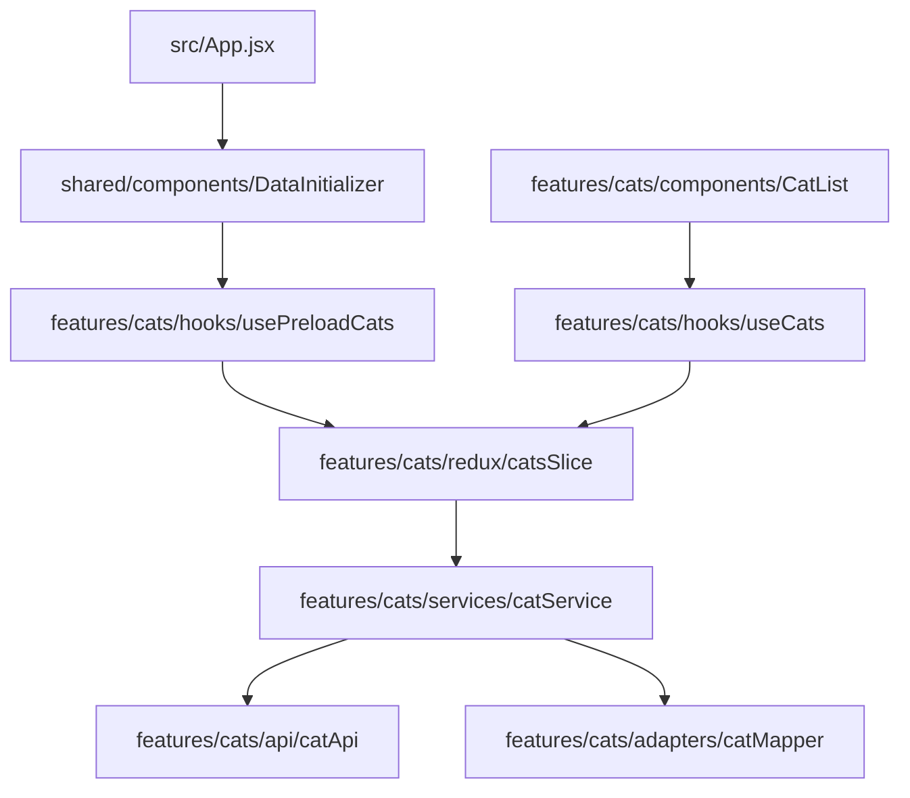

# 📋 PLAN_REFACTOR.md — Master Refactoring Plan
## Proyecto: myprojectapi11 | Arquitectura: FSD (Feature-Sliced Design)

Este documento detalla las acciones a realizar en las siguientes fases de refactorización para mejorar la calidad del código, la mantenibilidad y la documentación pedagógica.

---

## 🛠️ INVENTARIO Y RESPONSABILIDADES

### 📁 src/app/
- **store.js**: Configuración central de Redux Toolkit.
  - *Acción*: Mantener. Verificar tipos en JSDoc.

### 📁 src/config/
- **env.js**: Gestión de variables de entorno con validación.
- **motionConfig.js**: Configuración de Framer Motion (LazyMotion).
  - *Acción*: Mantener. Asegurar que las constantes sigan `SCREAMING_SNAKE_CASE`.

### 📁 src/features/cats/
- **api/catApi.js**: Cliente Axios y endpoints.
- **adapters/catMapper.js**: Transformación API → Entidad (Zod).
- **services/catService.js**: Orquestación de llamadas.
- **redux/catsSlice.js**: Estado global y thunks.
- **hooks/useCats.js**: Fachada para componentes.
- **components/**: UI específica de gatos.
  - *Acción*: Renombrar subcomponentes internos a `PascalCase` si hay inconsistencias. Aplicar atomicidad en `CatCard.jsx`.

### 📁 src/features/theme/ & src/features/font/
- Estructura simplificada (hooks + redux + components).
  - *Acción*: Estandarizar con la estructura de `cats/` si la complejidad lo requiere (api/adapters opcionales si no hay API externa).

### 📁 src/shared/
- **ui/**: Componentes base (IconButton, Select).
- **components/**: Componentes transversales (ErrorBoundary, EmptyState).
- **utils/**: Utilidades (cn, debugLogger).
  - *Acción*: Mover `cn.js` a una carpeta de utilidades más visible. Asegurar que `debugLogger` se use consistentemente.

---

## 🗺️ MAPA DE DEPENDENCIAS (FLUJO)

---

## 📡 MAPA DE LA API

| Endpoint | Método | Función | Capa |
| :--- | :--- | :--- | :--- |
| `/images/search` | GET | `fetchRandomCats` | `catApi.js` |
| `/favourites` | GET/POST/DELETE | `fetchFavourites`, `saveFavourite`, `deleteFavourite` | `catApi.js` |

---

## 🚀 PLAN DE ACCIÓN POR FASES

### FASE 1: Naming & Clean Code (Agente A)
- [ ] Renombrar variables genéricas (e.g., `d` -> `data`, `fn` -> `callback`).
- [ ] Asegurar `PascalCase` en todos los componentes de `src/features/cats/components/subcomponents/`.
- [ ] Aplicar *Early Returns* en componentes con lógica condicional compleja.
- [ ] Documentar con JSDoc estricto donde falte.

### FASE 2: Arquitectura & Patrones (Agente B)
- [ ] Reforzar el patrón **Facade** en `useTheme` y `useFont`.
- [ ] Implementar **Compound Components** en `CatCard` (Header, Body, Footer).
- [ ] Asegurar que `catMapper.js` sea la única fuente de verdad para la forma de los datos.

### FASE 3: UX/UI & Componentes (Agente C)
- [ ] Atomizar `CatCard` en componentes más pequeños.
- [ ] Implementar estados de carga (Skeletons) más granulares.
- [ ] Mejorar la accesibilidad (aria-labels en botones de favoritos y tema).
- [ ] Asegurar consistencia de espaciado usando tokens de Tailwind.

### FASE 4: Documentación Pedagógica (Agente D)
- [x] Crear `src/docs/architecture/ARCHITECTURE.md` con diagramas Mermaid.
- [x] Crear guías de flujo de datos (`DATA_FLOW.md`).
- [x] Crear `COMPONENT_GUIDE.md` para estandarizar la creación de nuevos componentes.
 
### FASE 5: Robustez & Validación (Zod 4) (Agente E)
- [x] **Migración a Zod 4**: Actualización de dependencias y optimización de esquemas.
- [x] **Validación de Configuración**: Implementación de `EnvSchema` en `src/config/env.js`.
- [x] **Tipado en Ejecución**: Refuerzo de validaciones en `catMapper.js` para proteger la UI de datos externos corruptos.
 
---
 
## ✅ CRITERIOS DE ÉXITO

1. `pnpm lint` -> 0 errores/warnings.
2. `pnpm build` -> Éxito.
3. Cobertura completa de JSDoc.
4. Documentación navegable desde `src/docs/README.md`.
