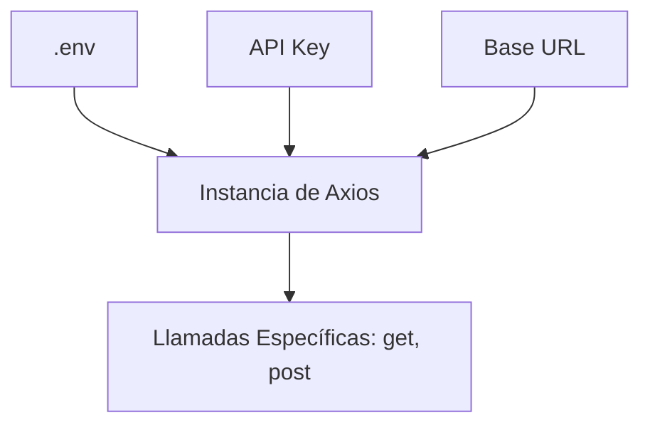
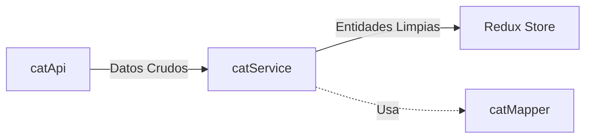

# Cliente API: Nuestra Infraestructura de Comunicación

Esta guía explica cómo se conecta nuestra aplicación con el mundo exterior (TheCatAPI) y las capas de seguridad y eficiencia que aplicamos.

---

## 1. El Problema: El caos de las URLs manuales

Imagina que en cada componente escribieras:
`fetch('https://api.thecatapi.com/v1/images/search?limit=10')`

- **Problema 1:** Si la URL cambia, tienes que editar 20 archivos.
- **Problema 2:** Tienes que pasar la API Key manualmente en cada llamada.
- **Problema 3:** El manejo de errores de `fetch()` es básico (tienes que comprobar `res.ok`).

**Nuestra Solución:** El Cliente Axios Configurado.

---

## 2. Configuración Centralizada (`catApi.js`)

En `src/features/cats/api/catApi.js` configuramos una **instancia de Axios**.



### Ventajas:
1.  **Seguridad:** La API Key viene de las variables de entorno (`.env`). Nunca se sube al código fuente.
2.  **Limpieza:** Todas las llamadas usan `VITE_BASE_URL` automáticamente.
3.  **Manejo de Errores:** Axios lanza una excepción por cualquier error `4xx` o `5xx` automáticamente.

---

## 3. Ejemplo de Uso Seguro

En lugar de construir URLs, pasamos parámetros limpios:

```javascript
// ✅ Correcto: catApi.js
export const getCats = (limit = 10) => {
  return catApiClient.get('/images/search', {
    params: { limit, order: 'DESC' }
  });
};
```

---

## 4. El Patrón "CatService" (Orquestación)

¿Por qué no llamar al API Client directamente desde Redux?
Porque necesitamos **Transformar los Datos**.



### El Servicio es quien:
- Llama al cliente API.
- Llama al **Mapper** para convertir los datos.
- Gestiona la lógica de negocio adicional.

---

## 5. Mejores Prácticas en este Proyecto

- **Sin `try/catch` en la API:** Deja que los errores burbujeen hacia arriba. El `catsSlice` de Redux se encarga de capturarlos y mostrar el mensaje de error al usuario.
- **JSDoc en cada llamada:** Documenta qué devuelve la función para que el editor te ayude con el autocompletado.
- **Separación de Concern:** `catApi` no sabe qué es un "Gato". Solo sabe hacer peticiones HTTP.
