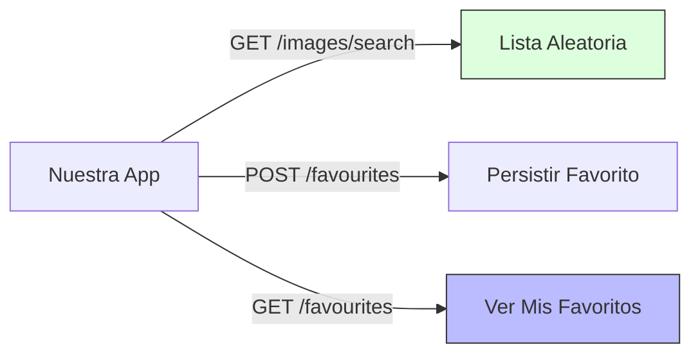

# Endpoints: Nuestra Conexión con TheCatAPI

En este proyecto solo usamos una parte pequeña pero poderosa de **TheCatAPI**. Esta guía te ayuda a entender qué datos pedimos y por qué.

---

## 1. El Problema: Demasiada información

La API de gatos tiene cientos de endpoints para razas, votaciones, análisis de imágenes, etc.
- **Problema:** Si intentamos usarlo todo a la vez, nuestra aplicación se vuelve lenta y compleja.

**Nuestra Solución:** Selección quirúrgica de Endpoints.

---

## 2. Los Endpoints que usamos

### A. Obtener Gatos Aleatorios
- **URL:** `/images/search`
- **Método:** `GET`
- **Parámetros:** `limit=10`, `order=RAND`
- **Por Qué:** Es el motor principal de nuestra pantalla de "Explorar". Cada vez que el usuario pulsa el botón, pedimos una nueva tanda.

### B. Obtener Mis Favoritos
- **URL:** `/favourites`
- **Método:** `GET`
- **Parámetros:** `sub_id=mi-usuario-unico`
- **Por Qué:** Nos permite persistir los gatos que le han gustado al usuario incluso si refresca la página o cambia de navegador.

### C. Guardar un Favorito
- **URL:** `/favourites`
- **Método:** `POST`
- **Payload:** `{ image_id: "abc", sub_id: "mi-usuario-unico" }`
- **Por Qué:** Cuando el usuario hace clic en el corazón rojo, enviamos esta orden al servidor para que lo guarde en su base de datos.

### D. Eliminar un Favorito
- **URL:** `/favourites/{favourite_id}`
- **Método:** `DELETE`
- **Por Qué:** Para permitir al usuario quitar un gato de su lista de favoritos.

---

## 3. Diagrama de Interacción de Datos (Mermaid)

---

## 4. El "sub_id": ¿Cómo identificamos al usuario?

Como no tenemos un sistema de login complejo, usamos un `sub_id` único para cada instalación.
- **Ubicación:** Configurado en `src/features/cats/api/catApi.js`.
- **Importancia:** Sin este ID, todos los usuarios de la aplicación verían los mismos favoritos. El `sub_id` crea una "cajita" privada para cada persona en el servidor de TheCatAPI.

---

## 5. Tabla de Referencia de Parámetros

| Parámetro | Valor Usado | Descripción |
| :--- | :--- | :--- |
| `limit` | `10` | Cantidad de gatos por carga. |
| `order` | `DESC` | Orden de los datos (más nuevos primero). |
| `include_breeds` | `1` | (Opcional) Incluye datos de la raza del gato. |
| `size` | `med` | Tamaño de imagen optimizado para la web. |
