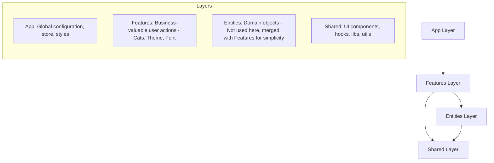

# Architecture: Feature-Sliced Design (FSD)

This project follows the **Feature-Sliced Design (FSD)** architectural pattern, which promotes modularity, scalability, and developer experience by organizing code according to its business value.

## System Overview

## Layers in MyProjectAPI11

### 1. App (`src/app/`)
The shell of the application. Contains:
- Redux Store configuration (`store.js`).
- Global providers (Redux, Framer Motion).

### 2. Features (`src/features/`)
Self-contained slices of functionality.
- **Cats**: Handling random and favourite cat images.
- **Theme**: Light/Dark mode management.
- **Font**: Dynamic font selection.

Each feature follows a strict internal structure:
- `api/`: External service communication.
- `adapters/`: Data transformation (Mappers).
- `services/`: Business logic orchestration.
- `redux/`: State management (Slices, Thunks).
- `hooks/`: Facades for UI interaction.
- `components/`: Feature-specific UI.

### 3. Shared (`src/shared//`)
Reusable logic and UI without business dependencies.
- `components/`: Generic UI (Buttons, Selects, Skeletons).
- `lib/`: Core utilities like `cn` (Tailwind Merge + Clsx) and `debugLogger`.
- `hooks/`: Generic hooks like `useAppearance`.

## Dependency Rule
Dependencies must always point **downwards**:
`App` -> `Features` -> `Shared`

A slice should never depend on another slice in the same layer. If interaction is needed, it must be mediated by the `App` layer or a common `Shared` utility.
