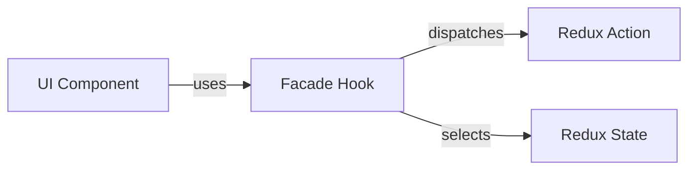
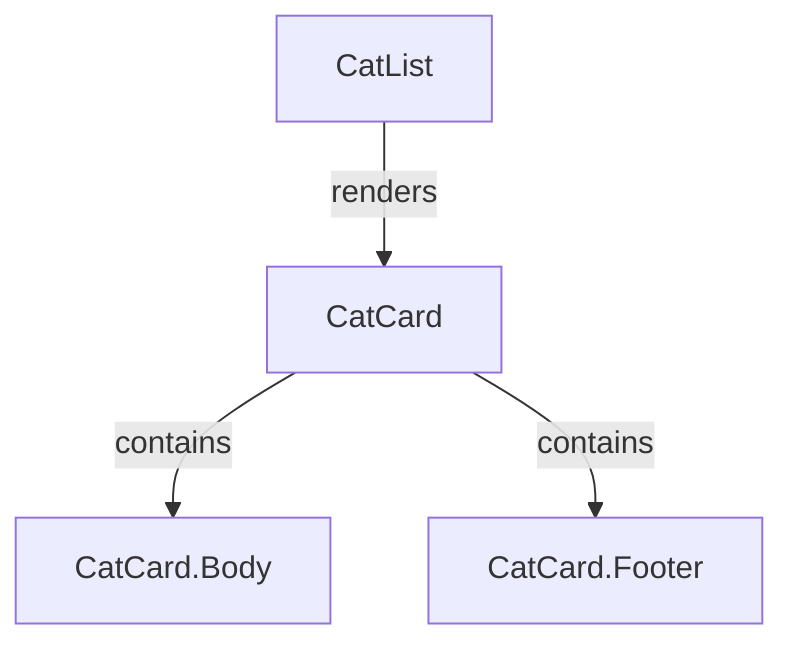
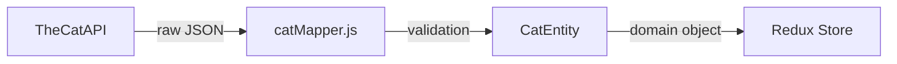

# Design Patterns: myprojectapi11

This project employs specific design patterns to solve common architectural and UI problems.

## 1. Facade Pattern (Hooks)

The **Facade Pattern** is implemented using custom React hooks to provide a simplified interface to the Redux state and actions. The UI components do not interact with Redux directly.

### How it works
- **Hooks** (`useTheme`, `useFont`, `useCats`) encapsulate `useDispatch` and `useSelector`.
- **UI Components** only consume these hooks.

## 2. Compound Components Pattern

The **Compound Components Pattern** is used in `CatCard` to provide a flexible and expressive way to compose the component's UI while maintaining internal consistency.

### How it works
- `CatCard` is a parent component that manages layout.
- `CatCard.Header`, `CatCard.Body`, and `CatCard.Footer` are subcomponents.

## 3. Data Mapper Pattern (Adapters)

The **Data Mapper Pattern** (implemented as Adapters) ensures that the application's domain logic and UI are decoupled from external API data structures.

### How it works
- `catMapper.js` transforms raw API data into normalized `CatEntity` domain objects.
- It uses **Zod** for runtime validation to ensure data integrity.

## 4. Layered Service Architecture

Each feature is organized into layers:
- **API Layer**: Low-level HTTP requests.
- **Service Layer**: Business logic and mapper orchestration.
- **Redux Layer**: State management and async thunks.
- **Hook Layer**: Facade for UI consumption.
