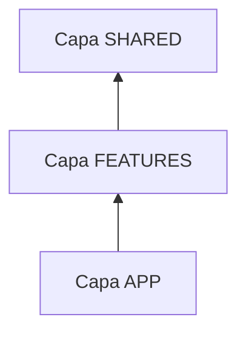

# Guía de Componentes: ¿Cómo crear una nueva Pieza?

Esta guía explica la anatomía de un componente en **Cat Gallery** y las reglas para decidir dónde colocarlo siguiendo la arquitectura **Feature-Sliced Design (FSD)**.

---

## 1. El Problema: "No sé dónde poner este archivo"

Imagina que quieres añadir una nueva funcionalidad para "Puntuar Gatos con Estrellas".
- ¿Pongo el botón en `components/`?
- ¿Pongo la lógica en `App.jsx`?
- ¿Cómo evito que mi nuevo componente rompa el resto de la galería?

---

## 2. La Regla de Oro: Dependencias de Capas

En FSD, las capas tienen una jerarquía de arriba a abajo. Un componente en una capa inferior **nunca** puede importar algo de una capa superior.



### ¿Dónde va mi componente?

1.  **¿Es un botón, un select o un spinner genérico?**
    - Va a **`src/shared/ui/`**.
    - Regla: No conoce nada del dominio ("Gatos"). Solo sabe de colores y clics.
2.  **¿Es una pieza que solo tiene sentido dentro de una funcionalidad (ej. `CatCard`)?**
    - Va a **`src/features/cats/components/`**.
    - Regla: Conoce la `CatEntity` pero no debe usar Redux directamente. Usa `props`.
3.  **¿Es un contenedor que orquestra una lista de datos?**
    - Va a **`src/features/cats/components/`** (ej. `RandomCatList`).
    - Regla: Es el encargado de recibir los datos de la **Fachada** y pasárselos a los hijos.

---

## 3. Estructura Sugerida de un Componente (SFC)

Todos los componentes deben ser **Stateless Functional Components** (en lo posible) y seguir este patrón:

```jsx
/**
 * @typedef {import('../adapters/catMapper').CatEntity} CatEntity
 */

/**
 * Descripción clara de qué hace el componente.
 * @param {Object} props
 * @param {CatEntity} props.cat - La entidad del gato.
 * @param {Function} props.onAction - Callback para el clic.
 */
export const MiComponente = ({ cat, onAction }) => {
  return (
    <div className="flex flex-col gap-4">
      
      <Button onClick={onAction}>Puntuar</Button>
    </div>
  );
};
```

---

## 4. El Patrón "Subcomponentes"

Si un componente de Feature se vuelve muy grande, divídelo en piezas más pequeñas dentro de una carpeta `subcomponents/`.

```text
features/cats/components/
├── CatCard.jsx          <-- Componente Principal
└── subcomponents/
    ├── CatCardHeader.jsx
    ├── CatCardBody.jsx
    └── CatCardFooter.jsx
```

### ¿Por qué? (Problem -> Solution)
- **Problema:** Un archivo de 300 líneas de JSX es imposible de leer.
- **Solución:** Al separar el "Footer" de la "Imagen", cada archivo tiene menos de 50 líneas. Es más fácil de testear y de entender.

---

## 5. Checklist para crear un Componente

- [ ] ¿Es PascalCase (ej. `BotonGato.jsx`)?
- [ ] ¿Usa la utilidad `cn()` para las clases de Tailwind?
- [ ] ¿Tiene documentación JSDoc para sus `props`?
- [ ] ¿Está en la capa correcta según FSD?
- [ ] ¿Evita usar `useSelector` y `useDispatch` (usa `props` o `Fachadas`)?
