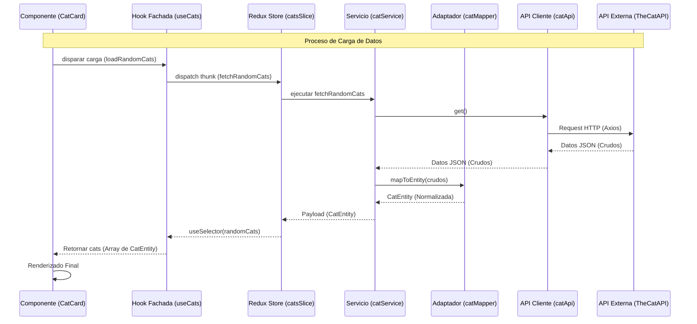

# Guía de Flujo de Datos: De la API a la Pantalla

Esta guía explica el viaje que realiza un dato desde que es solicitado a un servidor externo hasta que se renderiza como una imagen de un gato en el navegador.

---

## 1. El Problema: Datos Crudos vs. UI Amigable

Las APIs externas (como TheCatAPI) devuelven datos en un formato que no siempre es ideal para nuestra aplicación:
- Pueden tener campos que no necesitamos.
- Los nombres de los campos pueden no ser claros.
- Si la API cambia su estructura, tendríamos que cambiar todos los componentes.

**Nuestra Solución:** La Capa de Adaptación.

---

## 2. Diagrama de Flujo (Mermaid)



---

## 3. Desglose del Proceso (Paso a Paso)

### Paso 1: El Componente (UI)
El componente no sabe que existe una API. Solo sabe que el hook `useCats` le entrega una lista de "Gatos" y una función para cargarlos.

### Paso 2: La Fachada (`useCats`)
Oculta la complejidad de Redux. Gestiona el `dispatch` y selecciona los datos del `state`.

### Paso 3: El Servicio (`catService`)
Es el orquestador. Llama a la API para obtener datos y los pasa por el **Mapper** antes de entregarlos al Store.

### Paso 4: El Mapper (`catMapper`)
**Clave de la Arquitectura.** Transforma el objeto de la API en nuestra "Entidad de Dominio".
- Si la API cambia `url` por `image_path`, solo tocamos el Mapper. La UI nunca se entera.

### Paso 5: El Redux Store
Mantiene la "Única Fuente de la Verdad" (Single Source of Truth). Asegura que si cambias un gato en una pantalla, se actualice en todas.

---

## 4. Ejemplo Práctico: ¿Cómo se ve una CatEntity?

**Antes (API):**
```json
{
  "id": "abc123",
  "url": "https://cdn2.thecatapi.com/images/...",
  "width": 1200,
  "height": 800,
  "breeds": []
}
```

**Después (Mapper):**
```javascript
{
  id: "abc123",
  imageUrl: "https://cdn2.thecatapi.com/images/...",
  isFavourite: false // Añadido por nuestra lógica de negocio
}
```

---

## 5. Resumen de Responsabilidades

| Capa | Responsabilidad | ¿Dónde vive? |
| :--- | :--- | :--- |
| **Vista** | Mostrar píxeles y detectar clics. | `features/cats/components/` |
| **Fachada** | Interfaz simplificada para la UI. | `features/cats/hooks/` |
| **Estado** | Memoria caché de la aplicación. | `features/cats/redux/` |
| **Infraestructura** | Hablar con el mundo exterior (HTTP). | `features/cats/api/` |
