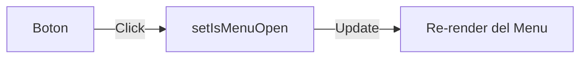
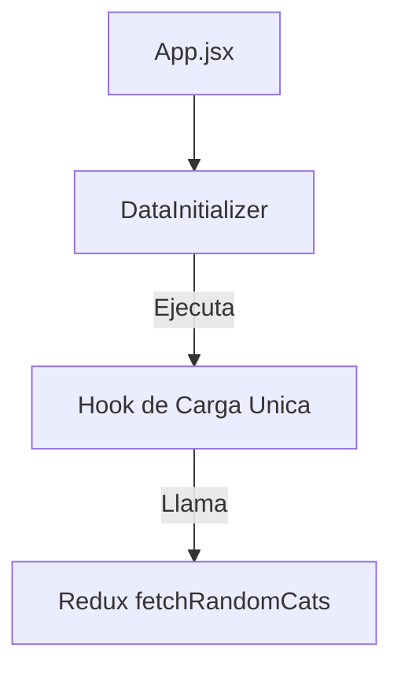

# Conceptos de React: ¿Cómo los aplicamos aquí?

Esta guía explica el uso de los Hooks fundamentales de React 19 y cómo los integramos en nuestra arquitectura de capas.

---

## 1. El Problema: El Ciclo de Vida es Caótico

Si pones `useEffect` en cada componente, terminas con:
- Llamadas a la API duplicadas.
- Fugos de memoria (memory leaks).
- Dificultad para saber **cuándo** se carga un dato.

**Nuestra Solución:** Centralizar el Ciclo de Vida.

---

## 2. Los Hooks que usamos (con Ejemplos)

### `useState` (Estado Local de UI)
Lo usamos **solo** para estados que no interesan al resto de la aplicación (ej: ¿está abierto un menú?).



### `useEffect` (Efectos Secundarios)
En este proyecto, los `useEffect` son escasos en los componentes de Feature. Los delegamos a hooks especializados como `useAppearance`.

- **Caso Real:** Cuando el tema cambia en Redux, `useAppearance` detecta el cambio e inyecta la clase en el HTML.
- **Problem:** Si no usamos el array de dependencias `[theme]`, el efecto se ejecutaría en cada pulsación de tecla, ralentizando la app.

### `useCallback` (Estabilización de Funciones)
Lo usamos para pasar funciones a componentes hijos (`React.memo`) y evitar renderizados innecesarios.

```javascript
// useTheme.js
const toggleTheme = useCallback(() => {
  dispatch(themeActions.toggle());
}, [dispatch]);
```

### `useMemo` (Cálculos Costosos)
Lo usamos para filtrar o transformar listas de datos grandes antes de pasarlas a la UI.

---

## 3. ¿Por qué NO usamos `useEffect` para cargar datos en la UI?

### El Problema (Anti-patrón):
```javascript
// ❌ No lo hagas así
const CatList = () => {
  useEffect(() => {
    fetch('/cats').then(...)
  }, [])
  return <UI />
}
```
Si el usuario navega y vuelve, la carga se dispara de nuevo sin control.

### Nuestra Solución (Data-on-mount Pattern):
Usamos un componente dedicado: **`DataInitializer.jsx`**.



---

## 4. Hooks de Redux: `useSelector` y `useDispatch`

- **Regla:** Solo deben aparecer en las **Fachadas** (`hooks/useCats.js`).
- **Por qué:** Si mañana cambiamos Redux por **Zustand** o **Context API**, solo tocamos el archivo de la Fachada. El 90% de la aplicación (la UI) seguirá funcionando sin cambios.

---

## 5. Resumen: ¿Qué usar y cuándo?

| Situación | Hook Recomendado | ¿Dónde colocarlo? |
| :--- | :--- | :--- |
| ¿Está cargando este botón? | `useState` | En el componente local. |
| ¿Cambiar el título de la página? | `usePageTitle` | En el hook de fachada o global. |
| ¿Transformar una lista de la API? | `useMemo` | En la fachada o componente de feature. |
| ¿Acción que depende del Store? | `useDispatch` | **Solo** en la Fachada. |
